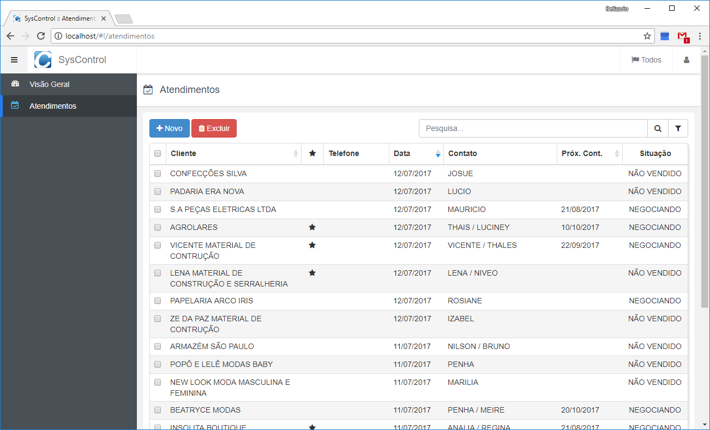
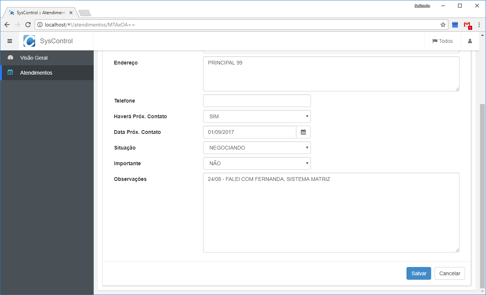
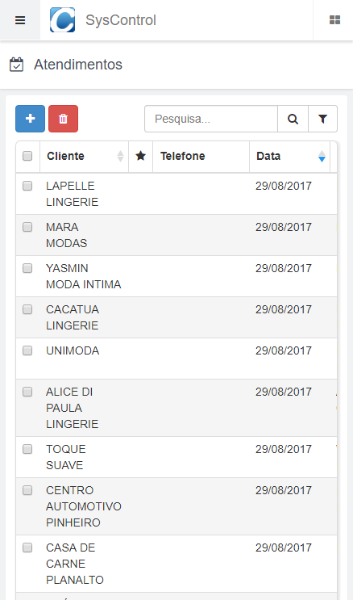
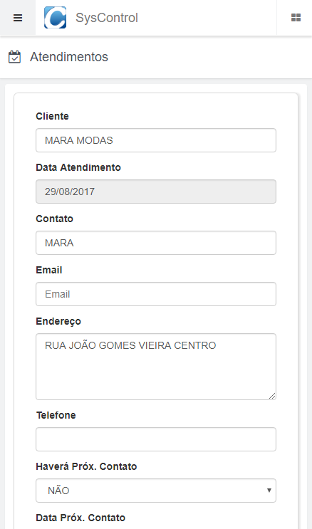

BGFramework - A Javascript CRUD framework 
=======================================


## This framework provides a fast implementation of a CRUD application using Node.js and Angular.js.

 * [Elegant Design](#elegant-design)
 * [Dynamic and Customizable]()
 * [Easy Implementation](#implementation)
 * [Modular Implementations](#backend-implementation) 
 * [Multi-language](#multi-language)
 
 
## What is BGFramework?

BGFramework is an interface to build fast CRUD applications using javascript (Angular.js for frontend and Node.js for backend) in 3 layers and MVC. This framework was 
written to make work easier and faster. To write some application, you just need to write the modules for frontend and backend and the framework do the rest.


## Elegant Design

The frontend of this framework has an elegant and responsive design, wich will fit very well in desktop browser and also in mobile browsers.






Installation
------------

To install, you only need to download [Node.js](https://nodejs.org) and [Firebird](http://www.firebirdsql.org) from they website and install in your system. After that, hit in your terminal or prompt:

```
npm install
node index
```


## Implementation

To create an app you must setup both, frontend and backend. For the backend, just edit "./config.js" and set values for your configuration. In the frontend, the config file is "./public_html/config.js"


After that you must create modules. The framework will provide all background implementation, then you only need to code your model and controller for the modules. 

You can run the backend with an html server. This will run both frontend and backend together. You also, can split the frontend by moving the content of "./public_html" folder to another server. Thus running each in a diferent server.


### Backend Implementation

In backend, you must create a new resource by creating a directory: "./resources/:CONTEXT:/:NAME_OF_RESOURCE:" that will contain at least one file called "controller.js" that will contain implementation of controller and the calls for the model or any other functions that you need for the resource. If you want to use models, you must create 2 more files called "list.js" and "record.js" that contains the models implementation.

For an example of this files, see the folder "./resources/v1/products"


### Frontend Implementation

In frontend, you must create modules. In this case, you will add an folder to "./public_html/app/mods/:MODULE_NAME:" that will contain a file called "controller.js" and 2 more files called "view.html" and "edit.html". This last two files, contains the user interface and fields. You also can create a .CSS file called "style.css" that will be applyed just for this module.

For an example of this files, see the folder "./public_html/app/mods/produtcs"

You can also, create plugins for the frontend to extend his implementations.


## Multi-language

The frontend has an implementation that alow you to create applications with more than one language. To create your on translation, just create a JSON file with the acronym of the language you want and put him in "./public_html/app/lang". 

Example: en-us.lang.json


## Bugs and New Implementations

Have found a bug? Want a new implementation: Please create an issue in our [bug tracker](https://github.com/belizariogr/BGFramework/issues).


## Contributing 

We encourage you to contribute to BGFramework! You can make pull requests of any improvement in our github page.


## Donations

If you like this framework and want to help us to grow and improve the implementations, donate any value! This will be a great help. You can donate in Paypal or PagSeguro to email belizario@msn.com.


[](https://www.paypal.com/cgi-bin/webscr?cmd=_donations&business=belizario%40msn%2ecom&lc=US&item_name=BGFramework&no_note=0&currency_code=USD&bn=PP%2dDonationsBF%3abtn_donateCC_LG%2egif%3aNonHostedGuest)
[](https://pag.ae/bhnKfqy)


## Contact

Talk directly with us sending an email directly to the project leader belizario@msn.com.


## License

BGFramework is made available under the MIT License, thus this means that you are free to do whatever you want, commercial, non-commercial, closed or open.